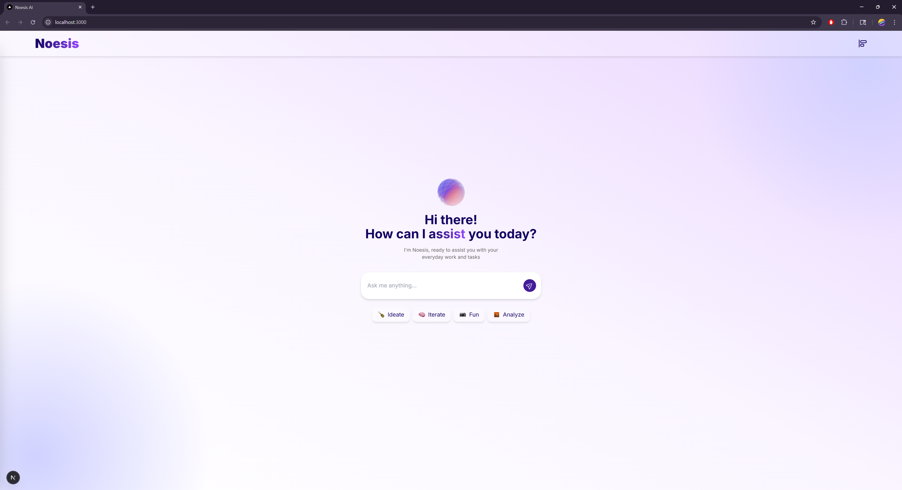
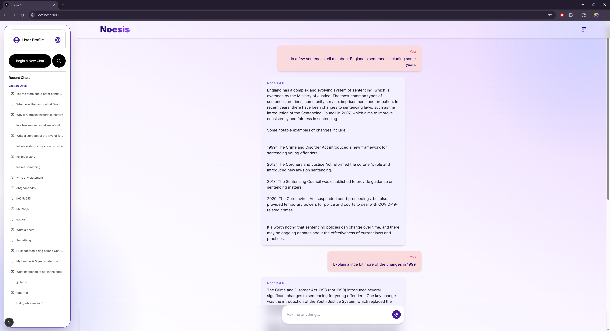
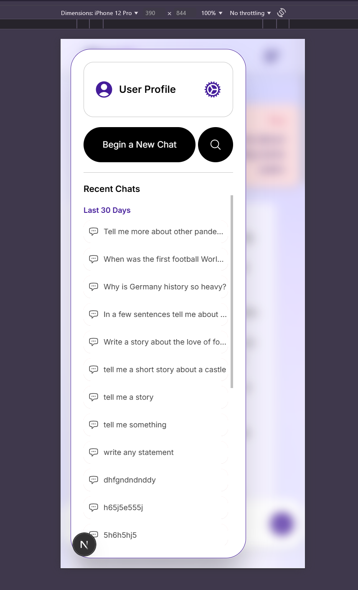
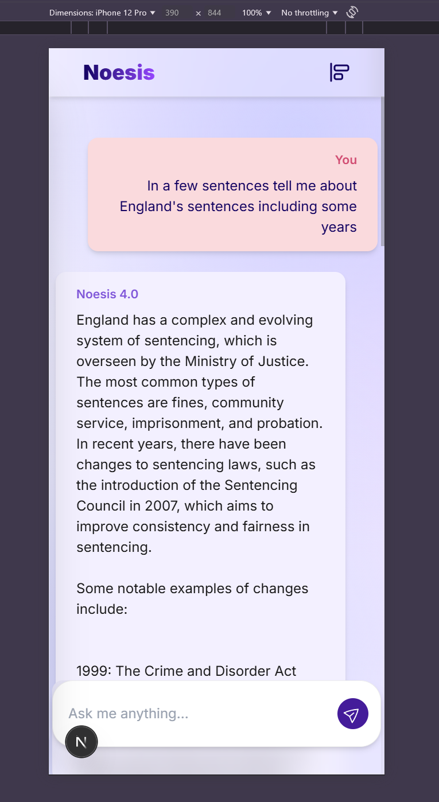

# 🧠 Noesis AI

**Noesis AI is a local-first conversational AI assistant that runs entirely on your machine — built with **Next.js**, **AdonisJS**, **PostgreSQL**, and a blazing-fast local LLM (**Llama3.2**) powered via **Ollama\*\*. It offers real-time, multi-turn chat experiences with full control over your data. Designed for speed, privacy, and personalization, Noesis AI brings the power of modern LLMs to your fingertips, no cloud required.

<div align="center">
  
  
  
  
  
  
  
</div>

---

## ✨ Features

- 🧩 **ChatGPT-style conversations** — Multi-turn chat with real-time streaming
- 💾 **Local-first** — All AI responses powered by your own device via Ollama
- 🔐 **Google/ Email Authentication** — Secure login and session handling (Coming soon)
- 🧠 **LLaMA 3.2 Integration** — Natural and fast language generation
- 🧭 **Session & History Management** — View, search, and load previous chats
- ⭐ **Favorites** — Mark prompts you love for quick access
- 🌙 **Dark mode ready** — Clean, responsive UI using Tailwind CSS (Coming soon)

---

## 🚀 Getting Started

> ⚠️ Make sure you have **Docker** to develop and run the project in a containerized environment without the need to install the other dependencies like **Node.js (v18+)**, **PostgreSQL**, and **Ollama**\
> ⚠️ Otherwise install all those tools for development

### <ins>_Developing with Docker_</ins>

### 1. Clone the Repository

```bash
git clone https://github.com/your-username/noesis-ai.git
cd noesis-ai
```

### 2. Run the migrations for the PostgreSQL database

```bash
docker compose exec backend node ace migration:run
```

### 3. Setup environment variables in root `noesis-ai/noesis-api/`

```bash
cd noesis-api
cp .env.example .env
cd ..
```

### 3. Start the development environment with Docker

```bash
docker compose watch
```

### 4. Edit code files with VS Code

The docker environment has been setup specifically for development so that it watches changes in the code files

### <ins>_Developing without Docker_</ins>

> ⚠️ Assuming you have Adonis6, PostgresSQL and Ollama installed

### 1. Clone the Repository

```bash
git clone https://github.com/your-username/noesis-ai.git
cd noesis-ai
```

### 2. Start the Backend (AdonisJS API)

```bash
cd noesis-api
cp .env.example .env
# Update .env with DB creds and Ollama config

npm install
node ace migration:run
npm run dev
```

### 3. Start the Frontend (Next.js App)

```bash
cd ../noesis-app
cp .env.local.example .env.local
# Fill in NEXT_PUBLIC_API_URL and Google OAuth settings

npm install
npm run dev
```

### 4. Start Ollama with LLaMA 3.2

```bash
ollama run llama3
# OR for dockerized:
docker run -p 11334:11434 ollama/ollama
```

---

## 🧪 Sample Prompt

> "Can you summarize the impact of the Industrial Revolution on global economic structures?"

Watch the local model respond in real time with a streaming animation ⚡

---

## 🛠️ Tech Stack

| Layer     | Tools                                                 |
| --------- | ----------------------------------------------------- |
| Frontend  | `Next.js`, `TypeScript`, `Tailwind CSS`               |
| Backend   | `AdonisJS`, `PostgreSQL`, `Lucid ORM`, `Google OAuth` |
| AI Engine | `Ollama`, `LLaMA 3.2`                                 |
| Dev Tools | `Docker`, `pnpm`, `Prisma` _(optional)_               |
| Hosting   | `Local` _(dev)_, `Railway`/`Vercel` _(optional)_      |

---

## 📁 Project Structure

```bash
noesis-ai/
├── noesis-app/     # Next.js frontend
├── noesis-api/     # AdonisJS backend
├── docker-compose.yaml         # Docker setup for local LLM and DB
```

---

## 📸 Screenshots

<p float="left">
  
  
</p>

<p float="left">
  
  
</p>

Example: Streamed prompt interaction, Sidebar history, PromptBox behavior, etc.

---

## 🧩 Todo

- LLM switching (Mistral, LLaMA 2, etc.)
- Session-based chat storage (Update it more)
- Voice-to-text input (If needed)
- Shareable chat snapshots
